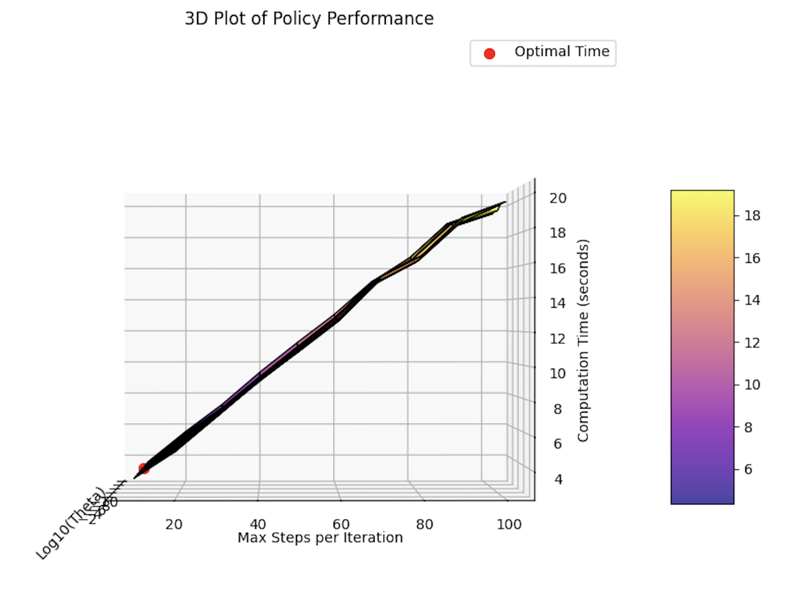

# Dynamic-Programming-MDP

### Policy Iteration

Before diving into optimizing the parameters to reduce the computational cost, we need a baseline to compare our new results with. The table below shows the performance before optimization.

| Metric                                                | Policy Iteration      |
|-------------------------------------------------------|-----------------------|
| Number of Iteration Steps                             | 64 (32 + 32)          |
| Total Number of Policy Evaluation Iterations          | 3115                  |
| Average Number of Policy Evaluation Iterations per Step | 97.34                |
| Computational Time (seconds)                          | 25.92                 |

In exploring the dynamics of policy iteration performance, this section employs a systematic grid-search methodology to examine the effects of two critical parameters: the convergence threshold ($\theta$) and maximum number of policy evaluation steps per iteration. We investigate policy iteration using a range of parameters, with `theta_values = [10^{-1}, 10^{-2}, ..., 10^{-9}, 10^{-10}]` and `max_steps_values = [10, 20, ..., 90, 100]`. This comprehensive analysis is designed to quantify the computational time implications of each parameter setting, capturing the duration of algorithm execution through the difference between start and end times. Given the exponential distribution of $\theta$ values, we implement a logarithmic scale for visualization and analysis.

As illustrated above, the lowest computational time is indicated by the red dot, highlighting the most efficient parameter set within the tested grid. This point corresponds to a $\theta$ of $10^{-5}$ and a `max_steps` value of 10, clocking in at 3.56 seconds. However, this may not be the best in practice for two reasons.

Firstly, the computational time does not increase significantly with larger $\theta$ values, suggesting that $\theta$ can be chosen based on the required accuracy of convergence instead of computational cost. Secondly, it can be seen that the maximum number of policy evaluation steps per iteration presents a direct relationship with computational time, but setting it too low may result in an evaluation process that does not fully converge to the best possible policy within the constraints of the given environment. Therefore, finding a compromise between computational cost and policy optimality is crucial.

The logical next step is to define a benchmark that has a high computational cost but guarantees optimality; the values from this benchmark will be used to compare to runs with a lower computational cost that may not be optimal, this is to select only parameters with optimal results. We use parameters $\theta = 10^{-10}$ and `max_steps = 200` to compute this. Then, fix $\theta = 10^{-5}$ (as we know that it has little effect on computational time) and run policy iteration on multiple varying `max_steps` values. On each run, calculate the maximum absolute difference between the value functions known as `delta`. We want to minimize `max_steps` while keeping `delta` less than a threshold, which we set as $10^{-4}$.

This process started with the same `max_steps_values` of `[10, 20, ..., 90, 100]`, and all of them were considered optimal. So, we narrowed it down to `[2, 4, ..., 18, 20]`. The results are as follows:

| Max Steps | Computation Time (seconds) | Delta                  | Optimal? |
|-----------|----------------------------|------------------------|----------|
| 2         | 1.850                      | \(1.54 \times 10^{-4}\)| No       |
| 4         | 1.824                      | \(1.34 \times 10^{-1}\)| No       |
| 6         | 2.177                      | \(8.83 \times 10^{-3}\)| No       |
| 8         | 2.716                      | \(5.33 \times 10^{-4}\)| No       |
| 10        | 3.210                      | \(8.71 \times 10^{-9}\)| Yes      |
| 12        | 3.641                      | \(1.10 \times 10^{-8}\)| Yes      |
| 14        | 3.913                      | \(1.72 \times 10^{-7}\)| Yes      |
| 16        | 4.260                      | \(2.05 \times 10^{-9}\)| Yes      |
| 18        | 4.381                      | \(7.51 \times 10^{-11}\)| Yes     |
| 20        | 4.586                      | \(2.11 \times 10^{-6}\)| Yes      |

According to the table, the policy iteration starts becoming optimal from `max_steps = 10`, but this is only for one run. Due to the stochastic nature of this problem, setting the parameters as $\theta = 10^{-5}$ and `max_steps = 16` initially is safer and the extra computation time is acceptable. If we want to push towards 10, cross-validation in different scenarios, extra testing, and averaging over different random seeds are recommended.

Table 3 presents a comparative analysis between the baseline and the tuned policy iteration methods. It is evident from the table that, although the number of iteration steps remains relatively unchanged, the total and average number of policy evaluation iterations saw a seven-fold decrease, and the computational time saw a three-fold decrease (the time could be bottlenecked by the visualization). Crucially, these improvements in performance metrics are achieved without the loss of accuracy, as shown by the negligible max absolute difference between the baseline model vs the tuned model. This near-zero difference signals that the value functions of both iterations are virtually identical, affirming that the strategies implemented have not detracted from the optimality of the solution.

| Metric                                              | Baseline Policy Iteration | Tuned Policy Iteration |
|-----------------------------------------------------|---------------------------|------------------------|
| Number of Iteration Steps                           | 64 (32 + 32)              | 62 (31 + 31)           |
| Total Number of Policy Evaluation Iterations        | 3115                      | 480                    |
| Average Number of Policy Evaluation Iterations per Step | 97.34                  | 15.48                  |
| Computational Time (seconds)                        | 25.92                     | 8.97                   |

### Value Iteration

The `ValueIterator` class implements the functions that make up the value iteration algorithm, `_compute_optimal_value_function` and `_extract_policy`. These functions are derived from `_evaluate_policy` and `_improve_policy` in policy iteration and result in an optimized algorithm that generally involves fewer iterations to find the optimal policy. The optimization comes from utilizing a single loop to merge policy evaluation and improvement. In policy iteration, to do one improvement step, first an entire evaluation stage must have been completed (i.e., converged for all states). Instead, value iteration directly substitutes the new policy found in the given iteration into the evaluation step. This leads to two key improvements:

1. Policy dependency is moved outside of `_compute_optimal_value_function` into `_extract_policy`, meaning the policy is extracted once when the optimal value function has already been found.
2. It is no longer necessary to keep track of the intermediate policies that previously resulted from each policy improvement step. As a result, the algorithm does not need to continuously recompute the current best policy and check if it is stable.

Given that value iteration is a combination of policy evaluation and improvement, our implementation (i.e., the Sutton and Barto approach) reuses the looping mechanisms and Bellman equations already seen in earlier sections. In `_compute_optimal_value_function`, we implement the single loop mentioned above, inside which we sweep over all states. For each state, we compute its new value:

$$
V(s) = \max_a \sum_{a} \pi(a|s) \sum_{r, s'} p(s', r | s, a) [r + \gamma V(s')]
$$

which is the same equation we saw for policy evaluation with the addition of taking the maximum over all actions a. Maximizing over the actions is done with yet another loop that iterates over each of the eight possible actions and computes the expected return `[r + gamma V(s')]` based on the next state and rewards distribution `p(s', r | s, a)`. When the maximum is found, we set it as the value for the given state we are in and compare it with the previous value. If their difference `Delta` is greater than the maximum delta `Delta_max` we encountered so far, we set it as the new delta, `Delta_max = Delta`. Once these operations have been carried out for all states, we check `Delta_max < theta`, where `theta` is the threshold for the value function convergence. If the value function does not converge, a new iteration starts. Eventually, the value function either converges or reaches the predefined number of maximum iterations, in which case we can expect a sub-optimal value function, hence policy.

To retrieve the optimal policy, we developed the `_extract_policy` function which sweeps over all of the states one last time. For each state, it implements the Bellman equation for determining the action that maximizes the value function:

$$
\pi'(s) = \argmax_a \sum_{a} \pi(a|s) \sum_{r, s'} p(s', r | s, a) [r + \gamma V(s')]
$$

The only difference in its implementation here compared to earlier is the update rule. Here, in `_extract_policy`, we already know that the value function has been optimized, therefore, we can directly set the optimal action for the given state with `self._pi.set_action(x, y, best_a)`. Once the sweep is finished, the policy in `self._pi` will contain the optimal action at each state, hence the overall optimal policy.
